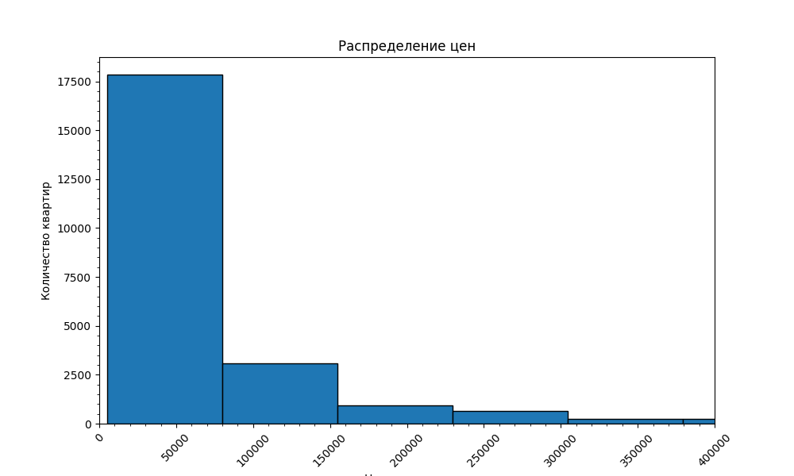
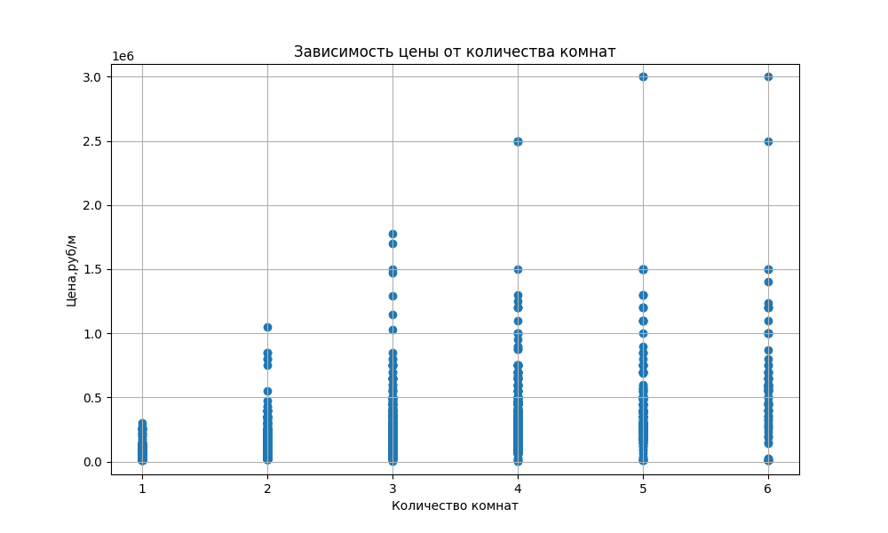
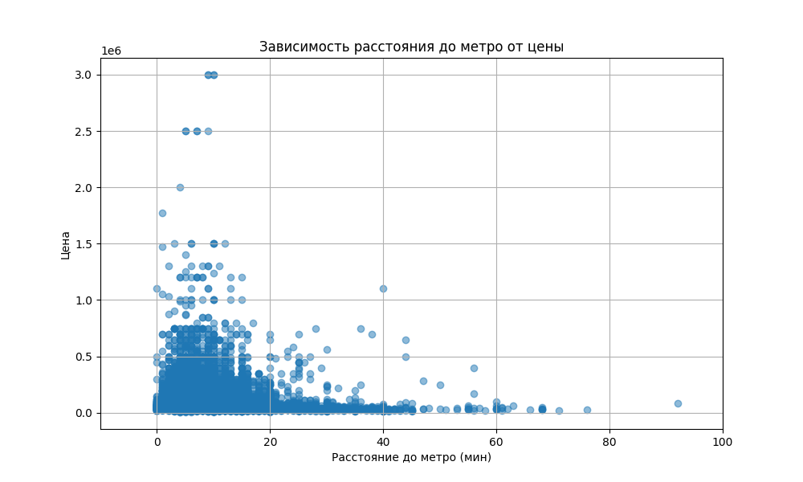
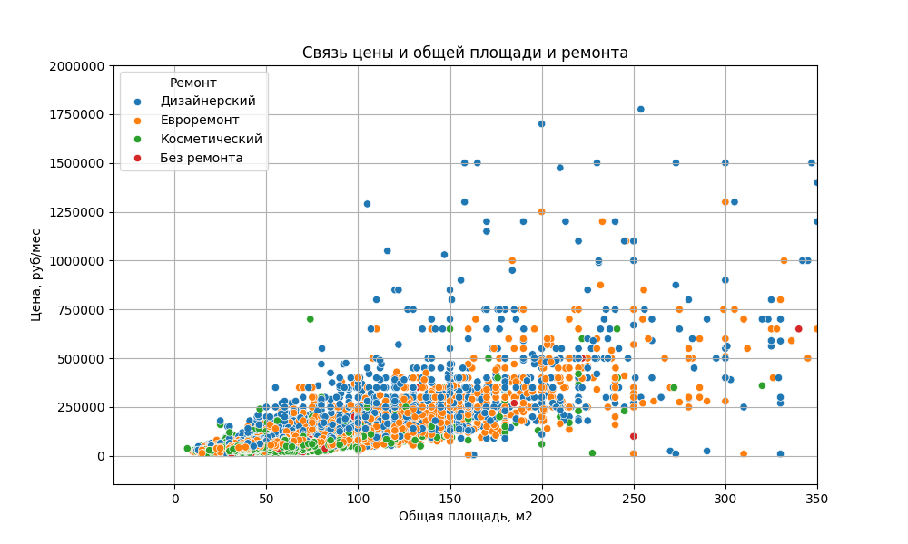
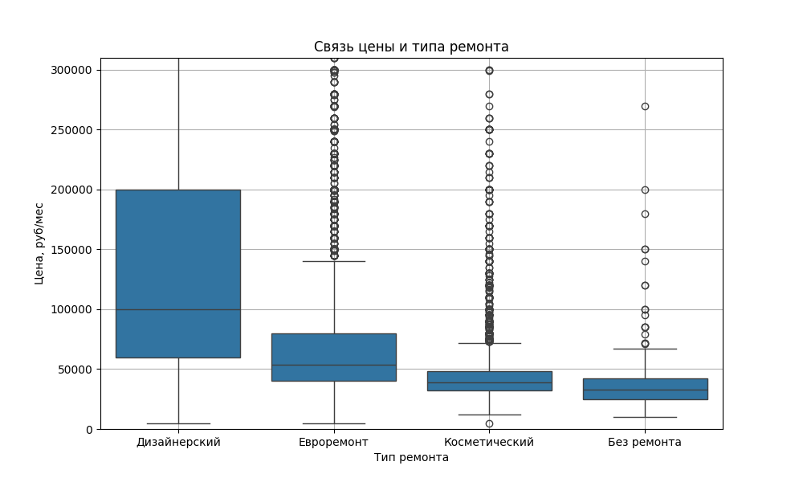
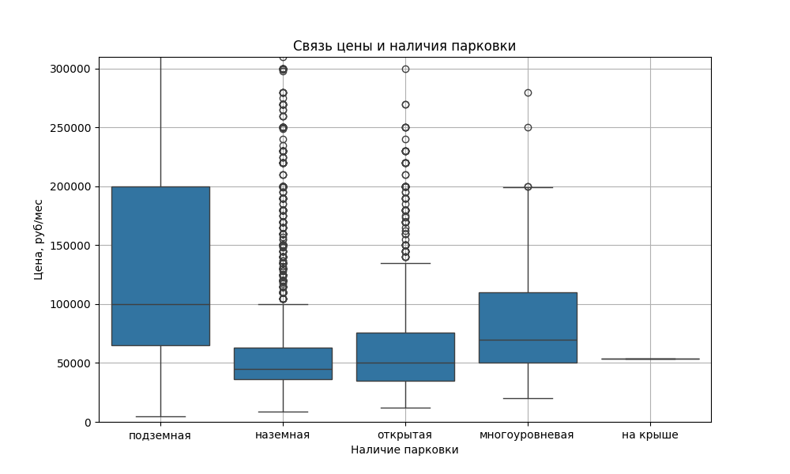

# Проект по оценке стоимости аренды квартир

## Описание

Данный  проект направлен на создание модели машинного обучения, которая будет оценивать квартиры и предлагать стоимость аренды, максимально похожую на ту, которую выставляют люди.

В качестве региона выбрана Москва.
На основании датасета включающего более 23 тысяч записей реальных объявлений.

Показан весь процесс обработки данных с комментариями, которые объясняют мотивацию принятия тех или иных решений в ходе работы

## Команда
 - [Михаил](https://github.com/allspicepaege)
 - [Илья](https://github.com/lefuuu)
 - [Дарья](https://github.com/DashonokOk)

## Релизы

### Релиз 1.0 - Разведочный анализ данных.

- [README.md](https://github.com/lefuuu/Final_project_phase-0/blob/main/README.md) описание задачи, состав участников, добавлены основные выводы и иллюстрации
- [EDA.html](https://github.com/lefuuu/Final_project_phase-0/blob/main/notebooks/EDA.html) - отчет из графиков и текстового описания
- [EDA.ipynb](https://github.com/lefuuu/Final_project_phase-0/blob/main/notebooks/EDA.ipynb) - jupyter notebook, в котором делали графики и изучали данные

### Релиз 2.0 - Результаты очистки данных от пропусков.

- [preprocessing.ipynb](https://github.com/lefuuu/Final_project_phase-0/blob/main/notebooks/preprocessing.ipynb) - jupyter notebook файл, где показан процесс обработки данных
- [data.csv](https://github.com/lefuuu/Final_project_phase-0/blob/main/data/_data.csv) - отвечающий критериям:
  - названия колонок на английском языке в одно/несколько слов с нижним подчёркиванием
  - в каждой колонке должны отсутствовать пропущенные значения (NaN, None и т.д.)

### Релиз 3.0 - Финальный.

В третьем релизе проекта  мы сосредоточились на подготовке данных для машинного обучения. Данные полностью готовы к использованию в моделях машинного обучения. В этом релизе четко указан таргет, который является ключевым для наших прогнозных моделей.

## Подготовка данных

Данные были тщательно очищены и преобразованы для обеспечения высокого качества и готовности к машинному обучению. Все столбцы данных проверены на наличие пропущенных значений и аномалий.

## Таргет

В этом релизе таргетом является колонка price. Этот столбец содержит целевую переменную, которую наши модели будут прогнозировать. Таргет расположен последним столбцом в наборе данных, что облегчает его использование в процессе обучения моделей.

- [data/data_dragons_data.csv](https://github.com/lefuuu/Final_project_phase-0/blob/main/data/data_dragons_data.csv) - полностью отвечающий предыдущим и новым критериям:
  - все значения внутри данных должны быть только численного типа (int или float)
  - должны отсутствовать полные дубликаты объявлений, только уникальные объявления
- [preprocessing.ipynb](https://github.com/lefuuu/Final_project_phase-0/blob/main/notebooks/preprocessing.ipynb) - jupyter notebook файл, где показан весь процесс обработки данных с комментариями, которые объясняют мотивацию принятия тех или иных решений в ходе работы
-  [graphs](https://github.com/lefuuu/Final_project_phase-0/tree/main/graphs) - основные выводы и иллюстрации

### Выводы
В результате обработки данных и построения матрицы корреляций были выявлены признаки, которые в большей степени влияют на стоимость аренды.

## Основные выводы и иллюстрации

### Распределение цен

### Зависимость цены от количества комнат

### Зависимость цены от расстояния до метро 

### Связь цены и общей площади и ремонта

### Связь цены и типа ремонта

### Связь цены и наличия парковки

